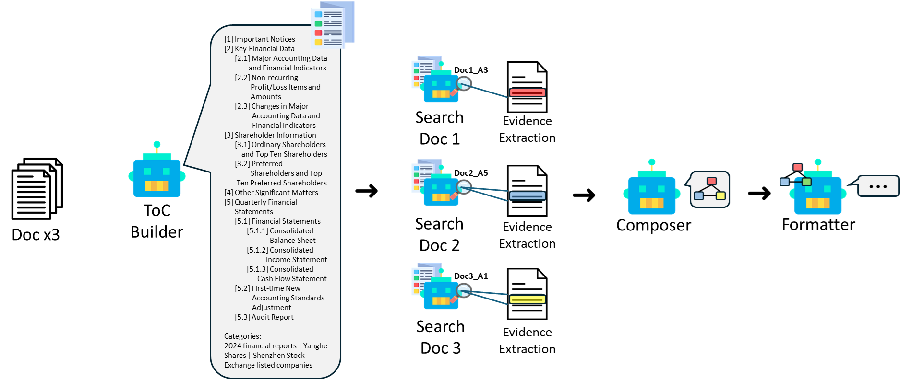

# DOSSIER: Document-Organized Section-wise Search and Synthesis for Interpretable Multi-Document Evidence Reasoning

DOSSIER is a document-structured, evidence-centric multi-document reasoning
pipeline. It keeps the current v2-v2-v1-v1 experiment logic while packaging the
code, prompts, scripts, benchmark checkout, and compact logs into a cleaner
submission repository.

## Pipeline



```text
TOCBuilder -> SearchAgent -> Composer -> Formatter
```

- `TOCBuilder` builds a line-numbered hierarchical table of contents and
  document-level Wikipedia-style categories.
- `SearchAgent` reads selected TOC sections and extracts 5W1H evidence records
  with verbatim source spans.
- `Composer` resolves document IDs, compares evidence across documents, and
  structures task-specific relations.
- `Formatter` converts the composed structure into the requested final answer.

Prompt contents are preserved from the current experiment. The prompt files were
only moved into stage-specific folders:

- `prompts/search_agent/` mirrors the original `doc_refine_v2` prompt.
- `prompts/composer/` mirrors the original `compose` prompt.
- `prompts/formatter/` mirrors the original `generate` prompt.
- `prompts/toc_builder/` externalizes the TOC prompt embedded in the v2 code.

## Layout

```text
DOSSIER/
  configs/                 # environment examples
  Loong/                   # benchmark checkout; data is loaded from here
  docs/                    # method notes
  logs/                    # compact run reports
  prompts/                 # stage prompts
  scripts/                 # experiment launchers
  src/dossier/             # Python package
  tests/                   # import smoke tests
```

## Setup

```bash
cd DOSSIER
bash scripts/setup_venv.sh
```

For client-only use with an already running OpenAI-compatible server:

```bash
bash scripts/setup_venv.sh --minimal
```

For the Docker setup, the experiment launch scripts still default to the conda
Python used in the previous runs:

```text
/opt/conda/bin/python
```

Override it with:

```bash
export DOSSIER_PYTHON=/path/to/python
```

For a fresh server, build a venv with `requirements.txt`; it pins the current
experiment stack, including `vllm==0.19.0`. If your CUDA/PyTorch wheel policy is
different, install the correct torch wheel first, then run the same requirements.

## Data

Put the Loong processed file at the same benchmark layout used by the
experiment scripts:

```text
Loong/data/loong_process.jsonl
```

You can also pass `--input_path`.

## Run

Use an existing OpenAI-compatible server:

```bash
export OPENAI_BASE_URL=http://127.0.0.1:8000/v1
export OPENAI_API_KEY=EMPTY
export OPENAI_MODEL=Qwen3.5-27B
bash scripts/run_existing_server_full.sh --force
```

Launch vLLM and automatically stop it when the run ends:

```bash
export DOSSIER_VLLM_MODEL_PATH=/path/to/Qwen3.5-27B
bash scripts/run_dossier_full.sh
```

Run directly:

```bash
python scripts/run_pipeline.py \
  --backend openai \
  --output_dir logs/runs/dossier_full
```

Each run writes timing artifacts for detailed analysis:

- `samples/<sample_id>/timings.json`
- `dossier_timings.jsonl`
- `reports/timing_summary.json`

The timing rows include `set`, `sample_id`, `module`, `scope`, optional
`doc_id/doc_title`, status, and elapsed seconds. TOCBuilder and SearchAgent
include per-document timings plus module totals; Composer and Formatter include
module totals.

## Historical Compact Result

The copied historical 99-sample report contains 98 judged predictions and 1
context-length error. LLM-judge perfect rate treats score `100` as a hit.

| Task / Level | Judge N | 100 Count | Perfect Rate | Avg Score |
|---|---:|---:|---:|---:|
| financial L1 | 12 | 12 | 100.0% | 100.0 |
| financial L2 | 21 | 17 | 81.0% | 86.7 |
| legal L3 | 30 | 11 | 36.7% | 69.7 |
| legal L4 | 3 | 3 | 100.0% | 100.0 |
| paper L3 | 13 | 10 | 76.9% | 83.8 |
| paper L4 | 19 | 16 | 84.2% | 89.5 |
| Total | 98 | 69 | 70.4% | 83.7 |

## Notes

- Original LAMBO is not required at runtime after migration.
- The raw dataset and model weights are intentionally not committed.
- Per-sample traces can be large; new runs write them under `logs/runs/.../samples/`.
